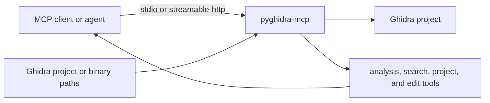
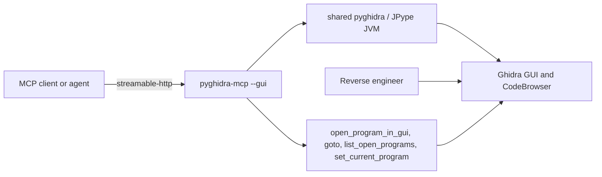
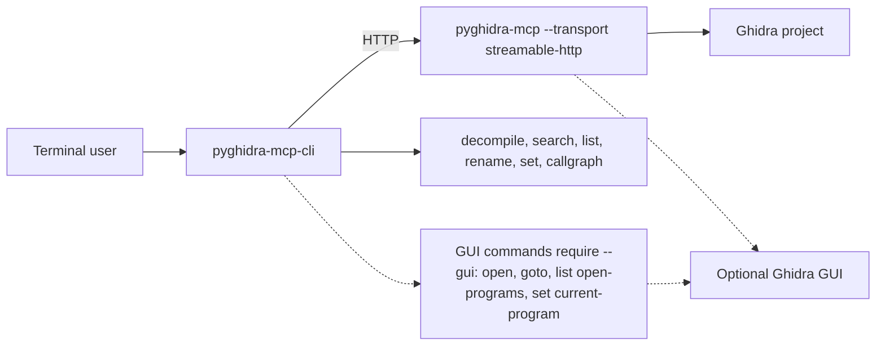
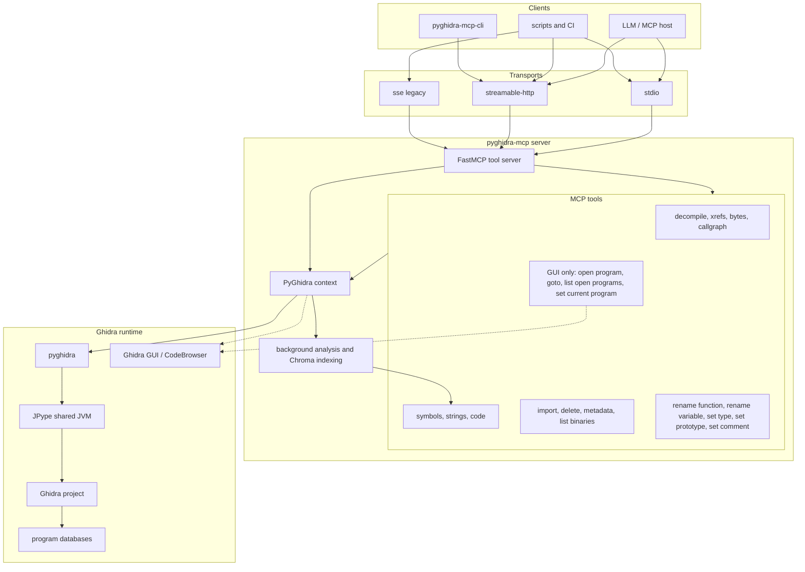

<p align="center">
  
</p>

<p align="center">
  
  
  
</p>

# PyGhidra-MCP - Ghidra Model Context Protocol Server


### Overview

**`pyghidra-mcp`** is a command-line Model Context Protocol (MCP) server that brings the full analytical power of [Ghidra](https://ghidra-sre.org/), a robust software reverse engineering (SRE) suite, into the world of intelligent agents and LLM-based tooling.
It bridges Ghidra’s [ProgramAPI](https://ghidra.re/ghidra_docs/api/ghidra/program/model/listing/Program.html) and [FlatProgramAPI](https://ghidra.re/ghidra_docs/api/ghidra/program/flatapi/FlatProgramAPI.html) to Python using `pyghidra` and `jpype`, then exposes that functionality via the Model Context Protocol. 

MCP is a unified interface that allows language models, development tools (like VS Code), and autonomous agents to access structured context, invoke tooling, and collaborate intelligently. Think of MCP as the bridge between powerful analysis tools and the LLM ecosystem. 

With `pyghidra-mcp`, Ghidra becomes an intelligent backend—ready to respond to context-rich queries, automate deep reverse engineering tasks, and integrate into AI-assisted workflows.

`pyghidra-mcp` now supports two operating modes:

- `headless` mode for CLI-driven analysis and automation
- `--gui` mode, which launches Ghidra through `pyghidra-mcp` and shares live program state with the running GUI


> [!NOTE]
> This beta project is under active development. We would love your feedback, bug reports, feature requests, and code.

## Yet another Ghidra MCP?

Yes, the original [ghidra-mcp](https://github.com/LaurieWired/GhidraMCP) is fantastic. But `pyghidra-mcp` takes a different approach:

- 🐍 **Headless-first, GUI-capable** – Run entirely via CLI for streamlined automation, or launch Ghidra with `--gui` when you want live GUI navigation and edits.
- 🔁 **Designed for automation** – Ideal for integrating with LLMs, CI pipelines, and tooling that needs repeatable behavior.
- ✅ **CI/CD friendly** – Built with robust unit and integration tests for both client and server sessions.
- 🚀 **Quick startup** – Asynchronous startup allows the server to start handling requests while binaries are still being analyzed in the background. Supports fast command-line launching with minimal setup.
- 📦 **Project-wide analysis** – Enables concurrent reverse engineering of all binaries in a Ghidra project
- 🤖 **Agent-ready** – Built for intelligent agent-driven workflows and large-scale reverse engineering automation.
- 🔍 Semantic code search – Uses vector embeddings (via ChromaDB) to enable fast, fuzzy lookup across decompiled functions, comments, and symbols—perfect for pseudo-C exploration and agent-driven triage.

This project provides a Python-first experience optimized for local development, headless environments, and testable workflows.

## Setup Diagrams

### Headless MCP Server



### GUI Setup



### CLI Setup



<details>
<summary>Detailed architecture and tool surface</summary>



</details>

## Contents

- [PyGhidra-MCP - Ghidra Model Context Protocol Server](#pyghidra-mcp---ghidra-model-context-protocol-server)
    - [Overview](#overview)
  - [Yet another Ghidra MCP?](#yet-another-ghidra-mcp)
  - [Setup Diagrams](#setup-diagrams)
  - [Contents](#contents)
  - [Getting started](#getting-started)
  - [Optimized for Agents](#optimized-for-agents)
  - [CLI Client](#cli-client)
  - [Project Creation, Management, and Opening Existing Projects](#project-creation-management-and-opening-existing-projects)
    - [Creating New Projects](#creating-new-projects)
      - [Self-Contained Project Structure](#self-contained-project-structure)
      - [Basic Project Creation](#basic-project-creation)
      - [Custom Project Creation](#custom-project-creation)
      - [Creating Multiple Related Projects](#creating-multiple-related-projects)
    - [Opening Existing Ghidra Projects](#opening-existing-ghidra-projects)
      - [Opening by .gpr File](#opening-by-gpr-file)
  - [Development](#development)
    - [Setup](#setup)
    - [Testing and Quality](#testing-and-quality)
  - [API](#api)
    - [Tools](#tools)
      - [Code Search](#code-search)
      - [Cross-References](#cross-references)
      - [Generate Call Graph](#generate-call-graph)
      - [Decompile Function](#decompile-function)
      - [Import Binary](#import-binary)
      - [List Exports](#list-exports)
      - [List Imports](#list-imports)
      - [List Project Binaries](#list-project-binaries)
      - [List Project Binary Metadata](#list-project-binary-metadata)
      - [Delete Project Binary](#delete-project-binary)
      - [Read Bytes](#read-bytes)
      - [Search Strings](#search-strings)
      - [Search Symbols](#search-symbols)
    - [Prompts](#prompts)
    - [Resources](#resources)
  - [Usage](#usage)
    - [Mapping Binaries with Docker](#mapping-binaries-with-docker)
    - [Using with OpenWeb-UI and MCPO](#using-with-openweb-ui-and-mcpo)
      - [With `uvx`](#with-uvx)
      - [With Docker](#with-docker)
    - [Standard Input/Output (stdio)](#standard-inputoutput-stdio)
      - [Python](#python)
      - [Docker](#docker)
    - [Streamable HTTP](#streamable-http)
      - [Python](#python-1)
      - [Docker](#docker-1)
    - [Server-sent events (SSE)](#server-sent-events-sse)
      - [Python](#python-2)
      - [Docker](#docker-2)
  - [Integrations](#integrations)
    - [Claude Desktop](#claude-desktop)
  - [Inspiration](#inspiration)
  - [Contributing, community, and running from source](#contributing-community-and-running-from-source)
    - [Contributor workflow](#contributor-workflow)

## Getting started

Run the [Python package](https://pypi.org/p/pyghidra-mcp) as a CLI command using [`uv`](https://docs.astral.sh/uv/guides/tools/):

```bash
uvx pyghidra-mcp # Creates pyghidra_mcp_projects directory by default
```

To launch and control a live Ghidra GUI from MCP, use `--gui` with `streamable-http` and an existing `.gpr` project:

```bash
uv run pyghidra-mcp \
  --gui \
  --transport streamable-http \
  --host 127.0.0.1 \
  --port 8000 \
  --project-path /absolute/path/to/my_project.gpr
```

> [!IMPORTANT]
> `--gui` launches Ghidra through `pyghidra-mcp`. It does not attach to an already-running external Ghidra instance.

Or, run as a [Docker container](https://ghcr.io/clearbluejar/pyghidra-mcp):

```bash
docker run -i --rm ghcr.io/clearbluejar/pyghidra-mcp -t stdio
```

## Optimized for Agents

`pyghidra-mcp` keeps the MCP surface intentionally narrow so agent clients spend fewer tokens on tool discovery and argument selection.

- **Short tool descriptions**: MCP tool docstrings are kept compact so FastMCP tool schemas stay small and cheap to send to models.
- **Context discipline**: tools return focused structured data instead of dumping whole-program context by default. Decompilation, symbol search, and cross-reference results are shaped to support iterative analysis rather than one large response.
- **GUI tools only when relevant**: GUI-only controls such as `open_program_in_gui`, `list_open_programs`, `set_current_program`, and `goto` are only exposed when the server is started with `--gui`.
- **CLI is optional**: if MCP is not your preferred interface, `pyghidra-mcp-cli` provides a direct command-line client over HTTP with grouped commands for common edit and analysis workflows.

This keeps the default server usable for LLM agents, IDE integrations, and automation without exposing unnecessary tool surface or GUI-only controls in headless sessions.

## CLI Client

For a more interactive command-line experience, you can use the separate **pyghidra-mcp-cli** package, which provides a user-friendly interface for interacting with a running pyghidra-mcp server.

### Installation

Install the CLI client using [`uv`](https://docs.astral.sh/uv/) (recommended):

```bash
uvx pyghidra-mcp-cli
```

Or install with pip:

```bash
pip install pyghidra-mcp-cli
```

### Quick Start with CLI

1. **Start the server** (in one terminal):
```bash
pyghidra-mcp --transport streamable-http /bin/ls
```

2. **Use the CLI** (in another terminal):
```bash
# List available binaries
pyghidra-mcp-cli list binaries

# Decompile a function
pyghidra-mcp-cli decompile --binary ls main

# Decompile with callees, referenced strings, and cross-references
pyghidra-mcp-cli decompile --binary ls main --callees --strings --xrefs

# Search for symbols (supports regex patterns)
pyghidra-mcp-cli search symbols --binary ls printf -l 10
```

> [!NOTE]
> The CLI connects to pyghidra-mcp via HTTP to avoid the 10-60 second startup overhead of spawning a new Ghidra process for each command. See the [CLI README](./cli/README.md) for complete documentation.

## Project Creation, Management, and Opening Existing Projects

### Creating New Projects

You can create new projects in several ways, depending on your workflow:

#### Self-Contained Project Structure

`pyghidra-mcp` creates a **self-contained project structure** where each project has its own Ghidra project and pyghidra-mcp artifacts. This ensures complete isolation and easy project management.

#### Basic Project Creation

```bash
# Create a new project with default settings
pyghidra_mcp

# Creates: 
$ tree pyghidra_mcp_projects/
pyghidra_mcp_projects/
├── my_project.gpr
├── my_project-pyghidra-mcp
│   ├── chromadb
│   └── gzfs
└── my_project.rep
```

#### Custom Project Creation

```bash
# Create project with custom name and location
pyghidra_mcp --project-path ~/analysis/malware_study --project-name malware_analysis

$ tree ~/analysis/ 
/home/vscode/analysis/
└── malware_study
    ├── malware_analysis.gpr
    ├── malware_analysis-pyghidra-mcp
    │   ├── chromadb
    │   └── gzfs
    └── malware_analysis.rep
```

#### Creating Multiple Related Projects

```bash
# Create separate projects for different analysis focuses
mkdir ~/reverse_engineering_workspace

# Project for suspicious binaries
pyghidra_mcp --project-path ~/reverse_engineering_workspace/suspicious_binaries --project-name suspicious_analysis

# Project for packed malware  
pyghidra_mcp --project-path ~/reverse_engineering_workspace/packed_malware --project-name packed_analysis
```

### Opening Existing Ghidra Projects

If you have existing Ghidra projects (`.gpr` files), you can open them directly with `pyghidra-mcp`:

#### Opening by .gpr File

```bash
# Open existing Ghidra project (project name derived from filename)
pyghidra_mcp --project-path ~/existing/ghidra/my_research.gpr

# Result: ~/existing/ghidra/my_research-pyghidra-mcp/
# └── chromadb/, gzfs/ (pyghidra-mcp additions)
```

### GUI Mode

Use GUI mode when you want MCP actions to operate against the same live program objects that Ghidra is displaying.

- `--gui` requires `--transport streamable-http`
- `--project-path` must point to an existing `.gpr`
- Ghidra is launched by `pyghidra-mcp`, which keeps GUI and MCP transactions in the same JVM
- GUI-only tools are only exposed when running with `--gui`

Example:

```bash
pyghidra-mcp \
  --gui \
  --transport streamable-http \
  --project-path /absolute/path/to/my_research.gpr
```

GUI mode is the right choice when you want to:

- open or switch programs in CodeBrowser
- navigate the listing to a function or address
- rename functions or add comments and immediately see those changes in Ghidra

### Startup Defaults and Large Projects

`pyghidra-mcp` does not require `--wait-for-analysis` by default. The server can start while analysis and MCP-side indexing continue in the background.

This matters for large projects:

- starting a project with many binaries does not need to block server startup
- `--wait-for-analysis` is available when you want a fully analyzed project before serving requests
- for large existing projects, expect analysis and indexing readiness to vary by binary

Current limitation:

- Ghidra analysis state and MCP indexing state are separate
- a binary can be fully analyzed in Ghidra while `search_strings` or semantic `search_code` are still waiting on MCP-side indexing
- this is more noticeable when opening larger existing projects

In practice:

- decompilation, navigation, renaming, and comments can still work for a binary while indexing-heavy search features are catching up
- if startup latency matters more than immediate search readiness, keep the default `--no-wait-for-analysis`
- if immediate readiness matters more than startup time, use `--wait-for-analysis`


## Development

This project uses a `Makefile` to streamline development and testing. `ruff` is used for linting and formatting, and `pre-commit` hooks are used to ensure code quality.

### Setup

1.  **Install `uv`**: If you don't have `uv` installed, you can install it using pip:
    ```bash
    pip install uv
    ```
    Or, follow the official `uv` installation guide: [https://docs.astral.sh/uv/install/](https://docs.astral.sh/uv/install/)

2.  **Create a virtual environment and install dependencies**:
    ```bash
    make dev-setup
    source ./.venv/bin/activate
    ```

3.  **Set Ghidra Environment Variable**: Download and install Ghidra, then set the `GHIDRA_INSTALL_DIR` environment variable to your Ghidra installation directory.
    ```bash
    # For Linux / Mac
    export GHIDRA_INSTALL_DIR="/path/to/ghidra/"

    # For Windows PowerShell
    [System.Environment]::SetEnvironmentVariable('GHIDRA_INSTALL_DIR','C:\ghidra_10.2.3_PUBLIC_20230208\ghidra_10.2.3_PUBLIC')
    ```

### Testing and Quality

The `Makefile` provides several targets for testing and code quality:

- `make run`: Run the MCP server.
- `make test`: Run the full test suite (unit and integration).
- `make test-unit`: Run unit tests.
- `make test-integration`: Run integration tests.
- `make test-integration-fast`: Run the lightweight integration smoke test used by pre-commit.
- `make test-integration-gui`: Run GUI integration tests. Requires a working Ghidra install and GUI support.
- `make lint`: Check code style with `ruff`.
- `make format`: Format code with `ruff`.
- `make typecheck`: Run type checking with `ruff`.
- `make check`: Run all quality checks.
- `make dev`: Run the development workflow (format and check).
- `make build`: Build distribution packages.
- `make clean`: Clean build artifacts and cache.

Recommended split:

- pre-commit: `ruff`, `pyright`, unit tests, and one lightweight integration smoke test
- GitHub Actions: full headless integration coverage plus the supported Linux GUI lane under `Xvfb`
- local/manual: macOS GUI validation and any heavier environment-specific debugging

## API

### Tools

Enable LLMs to perform actions, make deterministic computations, and interact with external services.

#### Batch Operations

`decompile_function` and `list_xrefs` accept a single target or a list of targets, reducing round-trips when analyzing call chains or multiple symbols at once.

```jsonc
// Decompile three functions in one call, with callees and xrefs attached
{
  "binary_name": "firmware.bin",
  "name_or_address": ["main", "init_hardware", "0x08001234"],
  "include_callees": true,
  "include_xrefs": true
}

// Get cross-references for multiple symbols at once
{
  "binary_name": "firmware.bin",
  "name_or_address": ["malloc", "free", "realloc"]
}
```

Per-item errors are returned inline (other targets still succeed):

```jsonc
[
  {"name": "main", "code": "void main() { ... }", "callees": ["init_hardware"], "xrefs": [...]},
  {"name": "0xdeadbeef", "code": "", "error": "Function or symbol '0xdeadbeef' not found."}
]
```

#### Read / Analysis Tools

- `search_code(binary_name: str, query: str, limit: int = 5)`: Search for code within a binary by similarity using vector embeddings.

- `list_xrefs(binary_name: str, name_or_address: str | list[str])`: List cross-references to function(s), symbol(s), or address(es). Accepts a single target or a list for batch lookup.

- `gen_callgraph(binary_name: str, function_name_or_address: str, direction: str = "calling", display_type: str = "flow", include_refs: bool = True, max_depth: int | None = None, max_run_time: int = 60, condense_threshold: int = 50, top_layers: int = 5, bottom_layers: int = 5)`: Generates a MermaidJS call graph for a specified function. Supports both "calling" (functions called by the target) and "called" (functions that call the target) directions with multiple visualization types.

- `decompile_function(binary_name: str, name_or_address: str | list[str], include_callees: bool = False, include_strings: bool = False, include_xrefs: bool = False, timeout_sec: int = 30)`: Decompile function(s) by name or address. Accepts a single target or a list for batch decompilation. Rich response flags attach callees, strings, and/or xrefs to each result. `timeout_sec` applies per target and bounds each decompilation attempt independently.

- `list_exports(binary_name: str, query: str = ".*", offset: int = 0, limit: int = 25)`: Lists all exported functions and symbols from a specified binary (regex supported for query).

- `list_imports(binary_name: str, query: str = ".*", offset: int = 0, limit: int = 25)`: Lists all imported functions and symbols for a specified binary (regex supported for query).

- `read_bytes(binary_name: str, address: str, size: int = 32)`: Reads raw bytes from memory at a specified address. Returns raw hex data. Useful for inspecting memory contents, data structures, or confirming analysis findings.

- `search_strings(binary_name: str, query: str, limit: int = 100)`: Searches for strings within a binary by name.

- `search_symbols_by_name(binary_name: str, query: str, functions_only: bool = False, offset: int = 0, limit: int = 25)`: Search for symbols within a binary by name. Supports regex patterns (e.g. `^main$`, `func.*one`) with case-insensitive matching, or plain substring queries. Set `functions_only=True` to exclude labels, variables, and other non-function symbols.

#### Project Operations

- `import_binary(binary_path: str)`: Imports a binary from a designated path into the current Ghidra project. If the path is a directory, it will recursively scan and import all supported binary files, preserving the directory structure within the Ghidra project.

- `list_project_binaries()`: Lists binaries in the current Ghidra project. In GUI mode this includes project binaries that exist on disk even if they are not currently open in CodeBrowser.

- `list_project_binary_metadata(binary_name: str)`: Retrieves detailed metadata for a specific binary, including architecture, compiler, executable format, analysis metrics, and file hashes.

- `delete_project_binary(binary_name: str)`: Deletes a binary (program) from the Ghidra project.

#### Edit / Mutation Tools

- `rename_function(binary_name: str, name_or_address: str, new_name: str)`: Rename a function by name or address. In GUI mode this runs as a live Ghidra transaction and updates the open program.

- `rename_variable(binary_name: str, function_name_or_address: str, variable_name: str, new_name: str)`: Rename a function parameter or local variable by exact name within a specific function. If the name is missing or ambiguous within that function, the tool returns an error instead of guessing. In GUI mode this runs as a live Ghidra transaction and updates the open program.

- `set_variable_type(binary_name: str, function_name_or_address: str, variable_name: str, type_name: str)`: Set the data type for a function parameter or local variable by exact name within a specific function. If the name is missing or ambiguous within that function, the tool returns an error instead of guessing. `type_name` is parsed using Ghidra's datatype parser against the program datatype manager.

- `set_function_prototype(binary_name: str, function_name_or_address: str, prototype: str)`: Set a function prototype from a full signature string. The tool always runs the prototype through Ghidra's native signature parser and returns the underlying parser or apply error if the prototype is invalid.

- `set_comment(binary_name: str, target: str, comment: str, comment_type: str)`: Set a function/decompiler comment or listing comment. Supported `comment_type` values are `decompiler`, `plate`, `pre`, `eol`, `post`, and `repeatable`.

#### GUI Control Tools (`--gui` only)

These tools are only available when `pyghidra-mcp` is started with `--gui` and control what the GUI is showing rather than mutating project data directly:

- `list_open_programs()`: List programs currently open in the Ghidra GUI.
- `open_program_in_gui(binary_name: str, new_window: bool = True)`: Open a project binary in CodeBrowser. By default this opens a new CodeBrowser window. Set `new_window=false` to reuse a visible CodeBrowser when possible.
- `set_current_program(binary_name: str)`: Make an open program the active/current program in the primary GUI tool context.
- `goto(binary_name: str, target: str, target_type: str)`: Navigate the Ghidra GUI to an address or function. `target_type` must be `address` or `function`.

### Prompts

Reusable prompts to standardize common LLM interactions.

- `write_ghidra_script`: Return a prompt to help write a Ghidra script.

### Resources

Expose data and content to LLMs

- `ghidra://program/{program_name}/function/{function_name}/decompiled`: Decompiled code of a specific function.

## Usage

This Python package is published to PyPI as [pyghidra-mcp](https://pypi.org/p/pyghidra-mcp) and can be installed and run with [pip](https://packaging.python.org/en/latest/guides/installing-using-pip-and-virtual-environments/#install-a-package), [pipx](https://pipx.pypa.io/), [uv](https://docs.astral.sh/uv/), [poetry](https://python-poetry.org/), or any Python package manager.

```text
$ uvx pyghidra-mcp --help
Usage: pyghidra-mcp [OPTIONS] [INPUT_PATHS]...

  PyGhidra Command-Line MCP server

  - input_paths: Path to one or more binaries to import, analyze, and expose with pyghidra-mcp
  - transport: Supports stdio, streamable-http, and sse transports.
  For stdio, it will read from stdin and write to stdout.
  For streamable-http and sse, it will start an HTTP server on the specified port (default 8000).

Options:
  -v, --version                     Show version and exit.
  -t, --transport [stdio|streamable-http|sse]
                                    Transport protocol to use: stdio,
                                    streamable-http, or sse (legacy).
  --project-path PATH               Location on disk which points to the Ghidra
                                    project to use. Can be an existing file.
                                    [default: pyghidra_mcp_projects]
  --project-name TEXT               Name for the project (used for Ghidra project
                                    files). Ignored when using .gpr files.
                                    [default: my_project]
  --gui / --no-gui                  Launch and control a live Ghidra GUI for the
                                    provided project. Requires streamable-http
                                    and an existing .gpr project.
                                    [default: no-gui]
  -p, --port INTEGER                Port to listen on for HTTP-based transports
                                    (streamable-http, sse). [default: 8000]
  -o, --host TEXT                   Host to listen on for HTTP-based transports
                                    (streamable-http, sse). [default: 127.0.0.1]
  --threaded / --no-threaded        Allow threaded analysis. Disable for debug.
                                    [default: threaded]
  --force-analysis / --no-force-analysis
                                    Force a new binary analysis each run.
                                    [default: no-force-analysis]
  --verbose-analysis / --no-verbose-analysis
                                    Verbose logging for analysis step.
                                    [default: no-verbose-analysis]
  --no-symbols / --with-symbols     Turn off symbols for analysis.
                                    [default: no-symbols]
  --gdt PATH                        Path to a GDT file for analysis. Can be
                                    specified multiple times.
  --program-options PATH            Path to a JSON file containing program
                                    options (custom analyzer settings).
  --gzfs-path PATH                  Location to store GZFs of analyzed
                                    binaries.
  --max-workers INTEGER             Number of workers for threaded analysis.
                                    Defaults to CPU count. [default: 0]
  --wait-for-analysis / --no-wait-for-analysis
                                    Wait for initial project analysis to
                                    complete before starting the server.
                                    [default: no-wait-for-analysis]
  -h, --help                        Show this message and exit.
```

### Mapping Binaries with Docker

When using the Docker container, you can map a local directory containing your binaries into the container's workspace. This allows `pyghidra-mcp` to analyze your files.

```bash
# Create and populate the new directory
mkdir -p ./binaries
cp /path/to/your/binaries/* ./binaries/

# Run the Docker container with volume mapping
docker run -i --rm \
  -v "$(pwd)/binaries:/binaries" \
  ghcr.io/clearbluejar/pyghidra-mcp \
  /binaries/*
```

### Using with OpenWeb-UI and MCPO

You can integrate `pyghidra-mcp` with [OpenWeb-UI](https://github.com/open-webui/open-webui) using [MCPO](https://github.com/open-webui/mcpo), an MCP-to-OpenAPI proxy. This allows you to expose `pyghidra-mcp`'s tools through a standard RESTful API, making them accessible to web interfaces and other tools.


https://github.com/user-attachments/assets/3d56ea08-ed2d-471d-9ed2-556fb8ee4c95


#### With `uvx`

You can run `pyghidra-mcp` and `mcpo` together using `uvx`:

```bash
uvx mcpo -- \
  pyghidra-mcp /bin/ls
```

#### With Docker

You can combine mcpo with Docker:

```bash
uvx mcpo -- docker run  ghcr.io/clearbluejar/pyghidra-mcp /bin/ls
```

### Standard Input/Output (stdio)

The stdio transport enables communication through standard input and output streams. This is particularly useful for local integrations and command-line tools. See the [spec](https://modelcontextprotocol.io/docs/concepts/transports#built-in-transport-types) for more details.

#### Python

```bash
pyghidra-mcp
```

By default, the Python package will run in `stdio` mode. Because it's using the standard input and output streams, it will look like the tool is hanging without any output, but this is expected.

#### Docker

This server is published to Github's Container Registry ([ghcr.io/clearbluejar/pyghidra-mcp](http://ghcr.io/clearbluejar/pyghidra-mcp))

```
docker run -i --rm ghcr.io/clearbluejar/pyghidra-mcp -t stdio
```

By default, the Docker container is in `SSE` mode, so you will have to include `-t stdio` after the image name and run with `-i` to run in [interactive](https://docs.docker.com/reference/cli/docker/container/run/#interactive) mode.

### Streamable HTTP

Streamable HTTP enables streaming responses over JSON RPC via HTTP POST requests. See the [spec](https://modelcontextprotocol.io/specification/draft/basic/transports#streamable-http) for more details.

By default, the server listens on [127.0.0.1:8000/mcp](https://127.0.0.1/mcp) for client connections. To change any of this, set [FASTMCP_*](https://github.com/modelcontextprotocol/python-sdk/blob/main/src/mcp/server/fastmcp/server.py#L78) environment variables. _The server must be running for clients to connect to it._

#### Python

```bash
pyghidra-mcp -t streamable-http
```

By default, the Python package will run in `stdio` mode, so you will have to include `-t streamable-http`.

GUI mode uses this transport:

```bash
pyghidra-mcp \
  --gui \
  --transport streamable-http \
  --project-path /absolute/path/to/my_project.gpr
```

#### Docker

```
docker run -p 8000:8000 ghcr.io/clearbluejar/pyghidra-mcp
```

### Server-sent events (SSE)

> [!WARNING]
> The MCP communiity considers this a legacy transport portcol and is really intended for backwards compatibility. [Streamable HTTP](#streamable-http) is the recommended replacement.

SSE transport enables server-to-client streaming with Server-Send Events for client-to-server and server-to-client communication. See the [spec](https://modelcontextprotocol.io/docs/concepts/transports#server-sent-events-sse) for more details.

By default, the server listens on [127.0.0.1:8000/sse](https://127.0.0.1/sse) for client connections. To change any of this, set [FASTMCP_*](https://github.com/modelcontextprotocol/python-sdk/blob/main/src/mcp/server/fastmcp/server.py#L78) environment variables. _The server must be running for clients to connect to it._

#### Python

```bash
pyghidra-mcp -t sse
```

By default, the Python package will run in `stdio` mode, so you will have to include `-t sse`.

#### Docker

```
docker run -p 8000:8000 ghcr.io/clearbluejar/pyghidra-mcp -t sse
```

## Integrations

> [!NOTE]
> This section is a work in progress. We will be adding examples for specific integrations soon.

### Claude Desktop

Add the following JSON block to your `claude_desktop_config.json` file:

```json
{
    "mcpServers": {
        "pyghidra-mcp": {
            "command": "uvx",
            "args": [
                "--from",
                "git+https://github.com/clearbluejar/pyghidra-mcp",
                "pyghidra-mcp",
                "--project-path",
                "/tmp/pyghidra", // or path to writeable directory
                "/bin/ls" //
            ],
            "env": {
                "GHIDRA_INSTALL_DIR": "/path/to/ghidra/ghidra_12.0_PUBLIC"
            }
        }
    }
}
```
## Inspiration

This project implementation and design was inspired by these awesome projects:

* [GhidraMCP](https://github.com/lauriewired/GhidraMCP)
* [semgrep-mcp](https://github.com/semgrep/mcp)
* [ghidrecomp](https://github.com/clearbluejar/ghidrecomp)
* [BinAssistMCP](https://github.com/jtang613/BinAssistMCP)

---

## Contributing, community, and running from source

We believe the future of reverse engineering is agentic, contextual, and scalable.  
`pyghidra-mcp` is a step toward that future—making full Ghidra projects accessible to AI agents and automation pipelines.

We’re actively developing the project and welcome feedback, issues, and contributions.

> [!NOTE]
> We love your feedback, bug reports, feature requests, and code.

### Contributor workflow

If you're adding a new tool or integration, here’s the recommended workflow:

- Label your branch with the prefix `feature/` to indicate a new capability.
- Add your tool using the same style and structure as existing tools in `pyghidra/tools/`.
- Write an integration test that exercises your tool using a `StdioClient` instance. Place it in `tests/integration/`.
- Extend concurrent testing by adding a call to your tool in `tests/integration/test_concurrent_streamable_client.py`.
- Run make test and make format to ensure your changes pass all tests and conform to linting rules.

This ensures consistency across the codebase and helps us maintain robust, scalable tooling for reverse engineering workflows.

______________________________________________________________________

Made with ❤️ by the [PyGhidra-MCP Team](https://github.com/clearbluejar/pyghidra-mcp)
